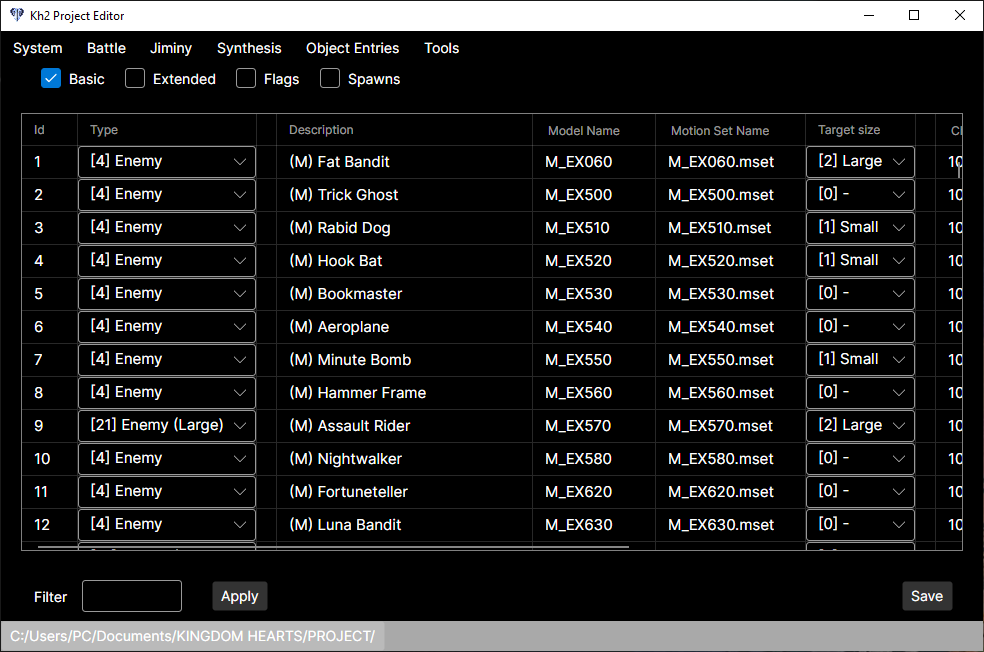
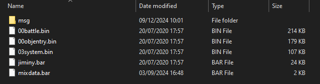
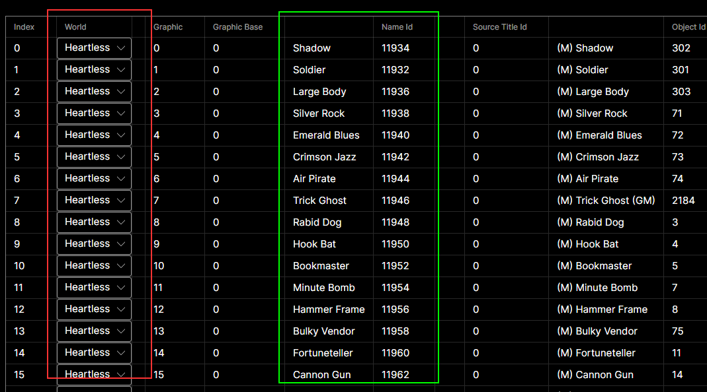
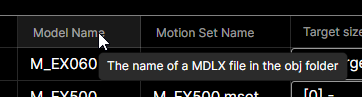

# Kh2 Project Editor

A multiplatform solution to edit the files from the game "Kingdom Hearts 2 Final Mix".

## How to use

Create a folder where the game files to be edited will be stored. The project folder should contain the following files:

* 00battle.bin
* 00objentry.bin
* 03system.bin
* jiminy.bar
* mixdata.bar (Synthesis)
* a msg folder containing the language message files (This is used to display names)

Then click on the bottom left button to open the folder.

### Notes on tables

Fields that are displayed as dropdowns (red) will have a small column to their right that can be used to sort the table by that column.

Fields that are ids (green) will have a non-editable column to their left displaying the name or description of the id.

Some column headers will display a tooltip with extra information when hovered over.

## Notes

* This is an early version, there's still a lot of work to do. Check out the KH2FMEditor app or OpenKh tools for other features.
* Currently the us messages are used by default and can't be changed.
* Currently entries can't be added or removed, only edited.

## Additional Credits

* [Re:Collection](https://televo.github.io/kingdom-hearts-recollection/): App icon from Televo's amazing collection.
* [MemorySharp](https://github.com/JamesMenetrey/MemorySharp): A memory editing library (Compiled from Github's v2 branch for x64 compatibility) 